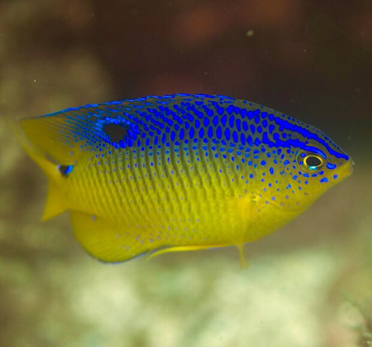

# Atividade 3
### Acesso a banco de dados abertos


A espécie-alvo será o peixe marinho *Stegastes variabilis*

```{r, echo=FALSE}

```

### Vamos começar!!!


###  **GBIF**


```{r, message=F, warning=F }
# abrindo pacotes

library(tidyverse)
library(rgbif)
library(dplyr)
library(CoordinateCleaner)
library(bdc)
library(ggplot2)
```


```{r, message=FALSE}
#checando função

?occ_data
```


```{r }
# Baixando ocorrências

donz_gbif <- occ_data(scientificName = "stegastes variabilis", 
                      hasCoordinate = TRUE,
                      hasGeospatialIssue=FALSE)
```


``` {r}
# Vendo dimensões

dim(donz_gbif)

dim(donz_gbif$data)
```


``` {r}
# checando campos

donz_gbif$data %>% names
```


Selecionando variáveis que serão úteis para a validação dos dados e futuras análises, como coordenadas, profundidade, nome da base de dados etc.


``` {r}
donz_gbif1 <- donz_gbif$data %>%
  dplyr::select(scientificName, acceptedScientificName, decimalLatitude, decimalLongitude,
                issues, waterBody, basisOfRecord, occurrenceStatus, rightsHolder, 
                datasetName, recordedBy, depth, locality, habitat) 
```


Total de 500 ocorrências, no entanto, vamos ver quantas são únicas aplicando a função `distinct` do pacote `dplyr`.


``` {r}
donz_gbif1 <- donz_gbif1 %>% 
  distinct() 
```


``` {r}
# Checando níveis dos fatores

lapply(donz_gbif1, unique)  
```


### Problemas não reportados


``` {r}

#Checar coordenadas válidas 
check_pf <- 
  bdc::bdc_coordinates_outOfRange(
    data = donz_gbif1,
    lat = "decimalLatitude",
    lon = "decimalLongitude")

# Checar coordenadas válidas e próximas a capitais 
cl <- donz_gbif1 %>%
  select(acceptedScientificName, decimalLatitude, decimalLongitude) %>%
  rename(decimallongitude = decimalLongitude,
         decimallatitude = decimalLatitude,
         scientificName = acceptedScientificName) %>% 
  as_tibble() %>% 
  mutate(val = cc_val(., value = "flagged"),
         sea = cc_sea(., value = "flagged"),
         capital = cc_cap(., value = "flagged"))
```

Verificar se as ocorrências estão em terra ou apenas próximas a países insulares.

``` {r}
# verificar coordenadas com flags

# capitais (padrão é um raio de 10km)
cl %>% 
  rename(decimalLongitude = decimallongitude,
         decimalLatitude = decimallatitude) %>% 
  bdc::bdc_quickmap(., col_to_map = "capital")  
```


``` {r}
cl %>% 
  rename(decimalLongitude = decimallongitude,
         decimalLatitude = decimallatitude) %>% 
  bdc::bdc_quickmap(., col_to_map = "sea") 
```

Uma maneira fácil de excluir dados em terra é checar a distribuição das ocorrências em relação às regiões oceanográficas indicadas nos dados (`waterBody`).

``` {r}
# investigar niveis suspeitos
donz_gbif1 %>% 
  distinct(waterBody) %>% 
  pull()
```

``` {r}
# waterBody
donz_gbif1 %>%
  group_by(waterBody) %>% 
  summarise(occ = length(scientificName)) %>% 
  ggplot(aes(occ, y=waterBody)) +
  geom_bar(stat = 'identity') 
```


Depois de colher informações sobre o táxon no **Fishbase**, as ocorrências indicadas são válidas e não precisam passar pela etapa de exclusão de dados suspeitos.


### Próximo passo é visualizar os pontos no mapa

``` {r, message=FALSE, warning=FALSE}
library(ggmap)
library(maps)
library(mapdata)

world <- map_data('world')

# checar pontos

ggplot() +
  geom_polygon(data = world, aes(x = long, y = lat, group = group)) +
  coord_fixed() +
  theme_classic() +
  geom_point(data = donz_gbif1, aes(x = decimalLongitude, y = decimalLatitude), color = "red") +
  labs(x = "longitude", y = "latitude", title = expression(italic("Stegastes variabilis")))
``` 


Checando profundidade, visto que no **Fishbase** o intervalo de profundidade para a espécie varia entre 0-30m.


``` {r, message=F, warning=F}
# checar profundidade
donz_gbif1 %>% 
  ggplot(aes(x = depth, fill = waterBody)) +
  geom_histogram() 

donz_gbif_ok <- donz_gbif1
```


## OBIS


Agora vamos fazer os mesmos procedimentos com os dados do **OBIS**, utilizando o pacote `robis` e a função `occurrence` deste pacote.

``` {r, message=F, warning=F}
library(robis)
```


```{r, message=F, warning=F}
# baixando as ocorrências
donz_obis <- robis::occurrence("Stegastes variabilis")
```

```{r}
# checando os dados
names(donz_obis)
```

```{r}
donz_obis1 <- donz_obis %>% 
  dplyr::select(scientificName, decimalLatitude, decimalLongitude, bathymetry,
                flags, waterBody, basisOfRecord, occurrenceStatus, rightsHolder, 
                datasetName, recordedBy, depth, locality, habitat) %>% 
  distinct()

# checando problemas reportados (flags)
donz_obis1 %>% 
  distinct(flags)
```


```{r}
# check NA em datasetName
donz_obis1 %>% 
  filter(!flags %in% c("no_depth,on_land", "on_land", "on_land,depth_exceeds_bath", "depth_exceeds_bath,on_land"),
         is.na(datasetName)) %>% 
  distinct(waterBody)
```

``` {r, message=F, warning=F}
# profundidade ok
donz_obis1 %>% 
  filter(!flags %in% c("no_depth,on_land", "on_land", "on_land,depth_exceeds_bath", "depth_exceeds_bath,on_land"),
         !is.na(datasetName)) %>% 
         #!waterBody %in% c("North America", "North America Atlantic", "atlantique")) %>% 
  ggplot(aes(x = depth, fill = waterBody)) +
  geom_histogram() 
```

```{r}
# checando niveis
donz_obis1 %>% 
  filter(!flags %in% c("no_depth,on_land", "on_land", "on_land,depth_exceeds_bath", "depth_exceeds_bath,on_land"),
         !is.na(datasetName)) %>% 
         #!waterBody %in% c("North America", "North America Atlantic", "atlantique")) %>% 
  lapply(., unique)
```

```{r}
# ok
donz_obis_ok <- donz_obis1 %>% 
  filter(!flags %in% c("no_depth,on_land", "on_land", "on_land,depth_exceeds_bath", "depth_exceeds_bath,on_land"),
         !is.na(datasetName),
         !waterBody %in% c("NA"))
```


Checando as ocorrências no mapa


```{r}
# check
ggplot() +
  geom_polygon(data = world, aes(x = long, y = lat, group = group)) +
  coord_fixed() +
  theme_classic() +
  geom_point(data = donz_obis_ok, aes(x = decimalLongitude, y = decimalLatitude, color = waterBody)) +
  labs(x = "longitude", y = "latitude", title = expression(italic("Stegastes variabilis")))
```

Tudo ok!


Por fim, vamos unir todas as ocorrências (GBIF e OBIS), checar se existem duplicatas e plotar o resultado final.

```{r}
#Unir gbif e obis

# ver diferencas
setdiff(names(donz_gbif_ok), names(donz_obis_ok))
```


```{r}
setdiff(names(donz_obis_ok), names(donz_gbif_ok))
```


```{r}
all_data <- bind_rows(donz_gbif_ok %>% 
                        mutate(repo = paste0("gbif", row.names(.))), 
                      donz_obis_ok %>% 
                        mutate(repo = paste0("obis", row.names(.)))) %>%
  column_to_rownames("repo") %>% 
  dplyr::select(decimalLongitude, decimalLatitude, depth) %>% 
  distinct() %>% 
  rownames_to_column("occ") %>% 
  separate(col = "occ", into = c("datasetName", "rn"), sep = 4) %>%
  mutate(scientificName = "Stegastes variabilis") %>% 
  dplyr::select(-rn)


# mapear ocorrencias
ggplot() +
  geom_polygon(data = world, aes(x = long, y = lat, group = group)) +
  coord_fixed() +
  theme_classic() +
  geom_point(data = all_data, aes(x = decimalLongitude, y = decimalLatitude, color = datasetName)) +
  #theme(legend.title = element_blank()) +
  labs(x = "longitude", y = "latitude", title = expression(italic("Stegastes variabilis")))
```

Baixando os dados já tratados

```{r}
write.csv(all_data, "occ_GBIF-OBIS_par_hepa.csv", row.names = FALSE)
```
